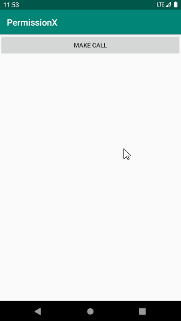
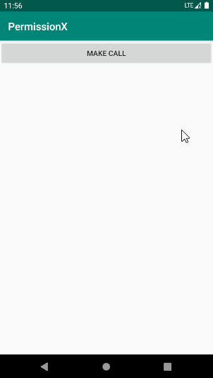
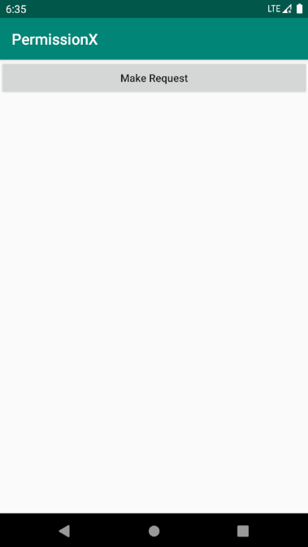
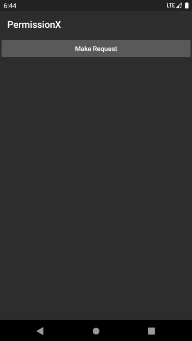

# PermissionX

[中文文档](https://blog.csdn.net/sinyu890807/category_10108528.html)

PermissionX is an extension Android library that makes Android runtime permission request extremely easy. You can use it for basic permission request occasions or handle more complex conditions, like showing rationale dialog or go to app settings for allowance manually.

## Quick Setup

Edit your build.gradle file and add below dependency.

```groovy
repositories {
  google()
  mavenCentral()
}

dependencies {
    implementation 'com.guolindev.permissionx:permissionx:1.7.1'
}
```

That's all. Now you are ready to go.

## Basic Usage

Use PermissionX to request Android runtime permissions is extremely simple.

For example. If you want to request READ_CONTACTS, CAMERA and CALL_PHONE permissions, declared them in the AndroidManifest.xml first.

```xml
<manifest xmlns:android="http://schemas.android.com/apk/res/android"
    package="com.permissionx.app">

	<uses-permission android:name="android.permission.READ_CONTACTS" />
	<uses-permission android:name="android.permission.CAMERA" />
	<uses-permission android:name="android.permission.CALL_PHONE" />

</manifest>
```

Then you can use below codes to request.

```kotlin
PermissionX.init(activity)
    .permissions(Manifest.permission.READ_CONTACTS, Manifest.permission.CAMERA, Manifest.permission.CALL_PHONE)
    .request { allGranted, grantedList, deniedList ->
        if (allGranted) {
            Toast.makeText(this, "All permissions are granted", Toast.LENGTH_LONG).show()
        } else {
            Toast.makeText(this, "These permissions are denied: $deniedList", Toast.LENGTH_LONG).show()
        }
    }
```

Pass any instance of FragmentActivity or Fragment into **init** method, and specify the permissions that you want to request in the **permissions** method, then call **request** method for actual request.

The request result will be callback in the request lambda. **allGranted** means if all permissions that you requested are granted by user, maybe true or false. **grantedList** holds all granted permissions and **deniedList** holds all denied permissions.



Now you can write your own logic in the request lambda to handle the specific cases of your app.

## More Usage

As you know, Android provide **shouldShowRequestPermissionRationale** method to indicate us if we should show a rationale dialog to explain to user why we need this permission. Otherwise user may deny the permissions we requested and checked **never ask again** option.

To simplify this process, PermissionX provide **onExplainRequestReason** method. Chain this method before **request** method, If user deny one of the permissions, **onExplainRequestReason** method will get callback first. Then you can call **showRequestReasonDialog** method to explain to user why these permissions are necessary like below.

```kotlin
PermissionX.init(activity)
    .permissions(Manifest.permission.READ_CONTACTS, Manifest.permission.CAMERA, Manifest.permission.CALL_PHONE)
    .onExplainRequestReason { scope, deniedList ->
        scope.showRequestReasonDialog(deniedList, "Core fundamental are based on these permissions", "OK", "Cancel")
    }
    .request { allGranted, grantedList, deniedList ->
        if (allGranted) {
            Toast.makeText(this, "All permissions are granted", Toast.LENGTH_LONG).show()
        } else {
            Toast.makeText(this, "These permissions are denied: $deniedList", Toast.LENGTH_LONG).show()
        }
    }
```

**showRequestReasonDialog** method will prompt a rationale dialog with the information that second parameter provide. If user click positive button which shows text as third parameter provide, PermissionX will request again with the permissions that first parameter provide.

The fourth parameter as text for negative button is optional. If the denied permissions are necessary, you can ignore the fourth parameter and the dialog will be uncancelable. Which means user must allow these permissions for further usage.


Of course, user still may deny some permissions and checked **never ask again** option. In this case, each time we request these permissions again will be denied automatically. The only thing we could do is prompt to users they need to allow these permissions manually in app settings for continuation usage. But PermissionX did better.

PermissionX provide **onForwardToSettings** method for handling this occasion. Chain this method before **request** method, If some permissions are "denied and never ask again" by user, **onForwardToSettings** method will get callback. Then you can call **showForwardToSettingsDialog** method like below.

```kotlin
PermissionX.init(activity)
    .permissions(Manifest.permission.READ_CONTACTS, Manifest.permission.CAMERA, Manifest.permission.CALL_PHONE)
    .onExplainRequestReason { scope, deniedList ->
        scope.showRequestReasonDialog(deniedList, "Core fundamental are based on these permissions", "OK", "Cancel")
    }
    .onForwardToSettings { scope, deniedList ->
        scope.showForwardToSettingsDialog(deniedList, "You need to allow necessary permissions in Settings manually", "OK", "Cancel")
    }
    .request { allGranted, grantedList, deniedList ->
        if (allGranted) {
            Toast.makeText(this, "All permissions are granted", Toast.LENGTH_LONG).show()
        } else {
            Toast.makeText(this, "These permissions are denied: $deniedList", Toast.LENGTH_LONG).show()
        }
    }
```

The parameters in **onForwardToSettings** method are similar with **showRequestReasonDialog** method. When user click positive button, PermissionX will forward to the settings page of your app and user can turn on the necessary permissions very quickly. When user switch back to app, PermissionX will request the necessary permissions again automatically.



## Explain Before Request

It is always a good manner to show the rationale dialog and explain to users why you need these permissions before you actually request them.

To do that with PermissionX is quite simple. Just use **explainReasonBeforeRequest** method like below.

```kotlin
PermissionX.init(activity)
    .permissions(Manifest.permission.READ_CONTACTS, Manifest.permission.CAMERA, Manifest.permission.CALL_PHONE)
    .explainReasonBeforeRequest()
    ...
```

Now everything works like charm.



## Dark Theme

The rationale dialog provided by PermissionsX support Android dark theme automatically. If you change your device into dark theme, everything just works great.



## License

```
Copyright (C) guolin, PermissionX Open Source Project

Licensed under the Apache License, Version 2.0 (the "License");
you may not use this file except in compliance with the License.
You may obtain a copy of the License at

     http://www.apache.org/licenses/LICENSE-2.0

Unless required by applicable law or agreed to in writing, software
distributed under the License is distributed on an "AS IS" BASIS,
WITHOUT WARRANTIES OR CONDITIONS OF ANY KIND, either express or implied.
See the License for the specific language governing permissions and
limitations under the License.
```
